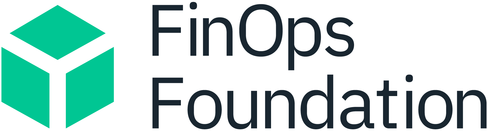
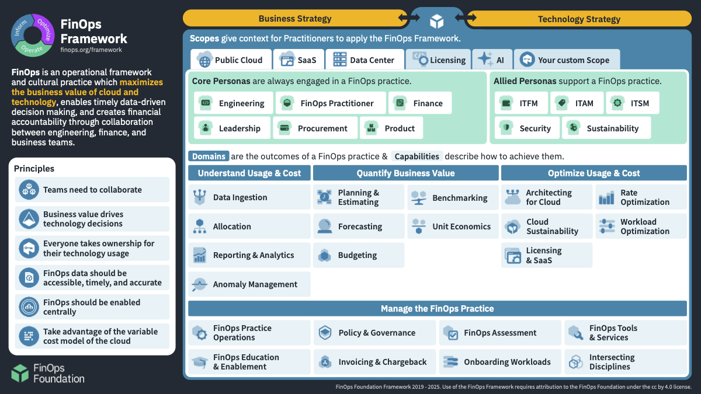
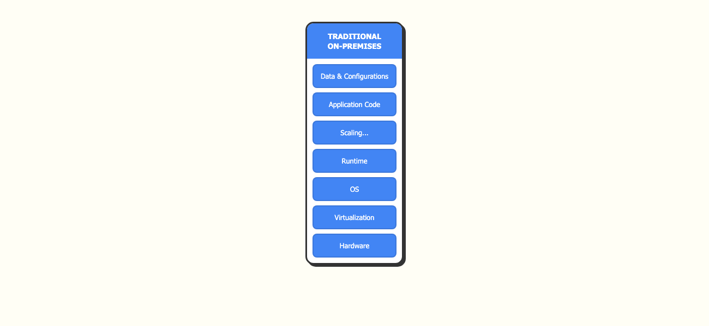
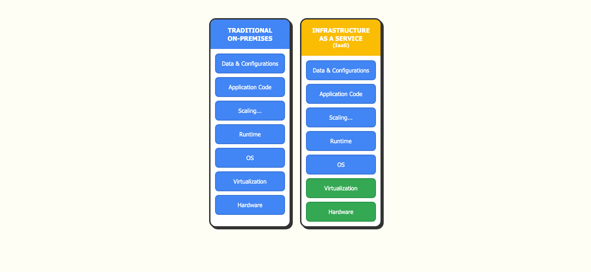
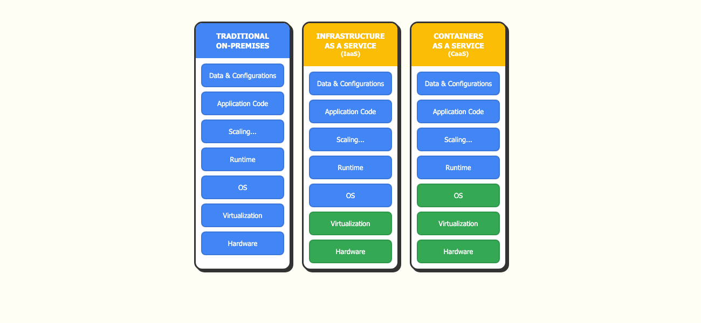
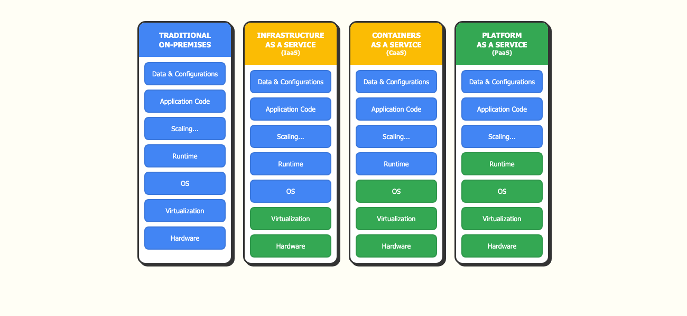
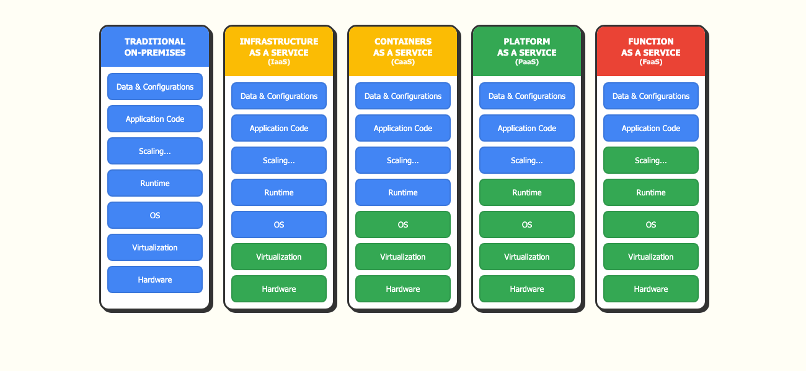
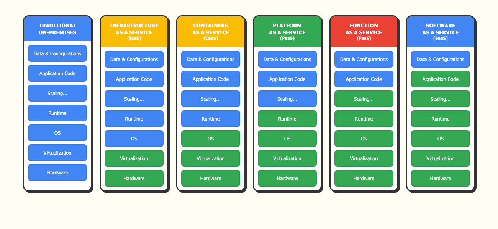
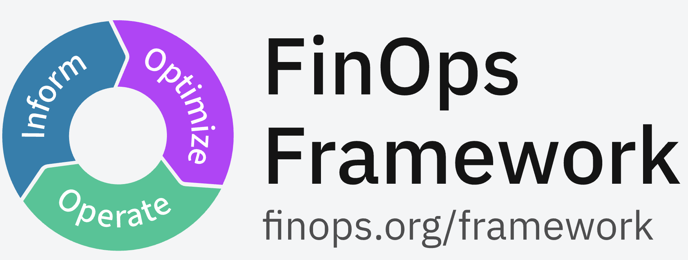

<!-- _class: lead
color: #000
colorSecondary: #333
backgroundColor: #fff
-->

# Cloud Computing - FinOps

<small style="font-size:25px">Wojciech Barczyński</small>

---

<!-- _class: lead -->

### Sprawdzenie obecności

---

<!-- _class: lead -->

## Slajdy

 &rarr; [github.com/wojciech11/se_cloud_finops](https://github.com/wojciech11/se_cloud_finops)

---

<!-- _class: lead -->

## O mnie

- VP of Engineering Platform @ Kubermatic
- Poprzednio: VP of Engineering @ Spacelift (Series C)
- Doświaczenie startupy i scale-ups, AI/ML, B2B i B2C
- 1100+ h szkoleń, 30+ wystąpień na konferencjach
- *„Wszystko jest iteracją, wszystko jest eksperymentem"*

---

<!-- _class: lead
color: #000
colorSecondary: #333
backgroundColor: #fff
-->

## Agenda

1. Co to jest FinOps?
2. Usługi chmurowe
3. Koszty z punktu widzenia technicznego
4. Koszty vs innowacja
5. FinOps Framework

---

<!-- _class: lead -->

## FinOps

1. Maksymalizacja wartości biznesowej z wydatków na chmurę
2. Współpraca między finansami, inżynierią i biznesem
3. Narzędzia i praktyki do zarządzania kosztami chmury
4. Świadome kompromisy: szybkość vs koszt vs jakość

---

<!-- _class: lead -->

## FinOps

Podobnie jak Lean, czy DevOps, jest to kulturą, pracą w iteracjach, niekoniecznie restrykcyjny proces.

---

<!-- _class: lead -->

- FinOps Foundation - projekt Linux Foundation (od 2020), 60k+ członków z 15k+ firm, certyfikacje i standardy (FOCUS)
- FinOps Framework - zestaw zaobserwowanych praktyk + mental model dla FinOps oraz rekomendacje

---

<!-- _class: lead -->

## FinOps Framework (à la carte)

---

<!-- _class: lead -->

### Cloud Computing

---

<!-- _class: lead -->

### Cloud Computing

Korzyści:

- Elastyczność i skala
- Przyśpieszenie innowacyjności
- Pay-as-you-go

---

<!-- _class: lead
color: #000
colorSecondary: #333
backgroundColor: #fff
-->

### Cloud Computing

---

<!-- _class: lead -->

### Cloud Computing

---

<!-- _class: lead -->

### Cloud Computing

---

<!-- _class: lead -->

### Cloud Computing

---

<!-- _class: lead -->

### Cloud Computing

---

<!-- _class: lead -->

### Cloud Computing

---

<!-- _class: lead -->

## On-Premise

To nie komputery w piwnicy:

- On-Premise &rarr; Private Cloud
- Wirtualne Maszyny &rarr; Kontenery (CaaS)
- Proprietary &rarr; Open Source (KubeVirt, Qemu)

<!-- see kube-virt, proxmox -->

---

<!-- _class: lead -->

## OPEX vs CAPEX

| OPEX (Operating Expenses)   | CAPEX (Capital Expenses)    |
| --------------------------- | --------------------------- |
| Bieżące koszty operacyjne   | Inwestycje kapitałowe       |
| Płatność za użycie          | Zakup z góry                |
| Elastyczność                | Długoterminowe zobowiązanie |
| Brak amortyzacji            | Amortyzacja w czasie        |
| Łatwiejsze skalowanie       | Trudniejsze skalowanie      |
| Łatwiej powiązać z biznesem |                             |

Cloud = OPEX model, CAPEX = on-Premise

---

<!-- _class: lead -->

## Pricing - Cloud

- Pay-as-you-go (_h_, ..., _zarządzane zasoby_)
- Reserved Resources
- Spot Resources

---

<!-- _class: lead -->

## Pricing - Cloud

| Model | Oszczędności | Charakterystyka |
|:------|:-------------|:----------------|
| Pay-as-you-go | 0% | Elastyczność, brak zobowiązań |
| Reserved | do 72% | Commitment 1-3 lata |
| Spot | do 90% | Może zostać przerwany |

$$Savings = \sum (C_{on\_demand} - C_{reserved}) - C_{waste}$$

---

<!-- _class: lead -->

## Pricing - On-Premises

W dużych firmach, departamenty rozliczają się w podobny sposób jak to się dzieje w chmurze.

---

<!-- _class: lead -->

## Total Cost of Ownership

---

<!-- _class: lead -->

### Koszty

$$TCO = C_{Infrastruktura} + C_{Ludzie} + C_{Ryzyko}$$

---

<!-- _class: lead -->

### TCO - orientacyjnie

|        | mała skala | średnia | duża | bardzo duża |
| ------ | ---------- | ------- | ---- | ----------- |
| OnPrem | 🔴         | 🔴      | 🟡   | 🟢\*        |
| IaaS   | 🟡         | 🟡      | ✅   | ✅          |
| CaaS   | 🟡         | ✅      | ✅   | ✅          |
| FaaS   | 🟢         | ✅      | 🟡   | 🔴          |
| PaaS   | 🟢         | 🟡      | 🔴   | 🔴          |

<small>🟢 niskie · 🟡 średnie · 🔴 wysokie · ✅ optymalne</small>

[tablica](https://excalidraw.com)

---

<!-- _class: lead -->

### TCO - orientacyjnie

1. PaaS dość szybko robi się drogi, vendor-locking!
2. PaaS migruje się na IaaS albo CaaS
3. Możemy przepisać aplikacje na FaaS
4. Nowa aplikacja? Gdzie możemy, używajmy FaaS!

---

<!-- _class: lead -->

### TCO - orientacyjnie

- CaaS i IaaS są obecnie najpopularniejsze.
- Rynek idzie w CaaS i FaaS.

---

<!-- _class: lead -->

## TCO - Grzechy PL/Europa

- buy, build, or wait
- tendencja na _build_ lub _wait_
- dotyczy to narzędzi i szkoleń

---

<!-- _class: lead -->

## TCO - Grzechy PL/Europa

1. Czas inżynierów kosztuje, zbudowanie rozwiązania czy konfiguracja Open Source nie jest za darmo
2. ... firmy zaskakuje TCO takiego rozwiązania, np., aktualizacje czy backup.

---

<!-- _class: lead -->

## TCO - Grzechy PL/Europa

- Mniej czasu na innowacje.

---

<!-- _class: lead -->

## TCO - buy, build, or wait

Rekomendacja:

1. Czy to jest core competency? Nie, &rarr; delegacja.
2. Proces (dokument) wokół decyzji _buy, build, or wait_
3. Śledzenie TCO rozwiązań in-house i reagowanie na problemy
4. Open Source/Open Core/unikać vendor lockingu.

<!--
1. Earn money
2. Save money
3. Save time
-->

---

<!-- _class: lead -->

# Koszt vs X

Relacja między kosztami (TCO i budowy/instalacji), a kluczowymi aspektami aplikacji/systemu.

---

<!-- _class: lead -->

## Koszt vs dostępność/SLA

- Wyższa dostępność &rarr; większy koszt

<small>[tablica](https://excalidraw.com)</small>

---

<!-- _class: lead -->

## Dostępność

Dostępność:

- **SLA**/SLO/SLI
- **Service Level Agreement**

---

<!-- _class: lead -->

## SLA

| SLA                  | Downtime/rok | Downtime/miesiąc |
| -------------------- | ------------ | ---------------- |
| 99.5%                | ~43h 48min   | ~3h 39min        |
| 99.9%                | ~8h 46min    | ~43min 50s       |
| 99.95%               | ~4h 23min    | ~21min 55s       |
| 99.99% (four nines)  | ~52min 36s   | ~4min 23s        |
| 99.999% (five nines) | ~5min 15s    | ~26s             |

---

<!-- _class: lead -->

## SLA

Pragmatycznie i systemowo:

- Ile nas kosztuje bycie offline?
- Zarządzanie oczekiwaniami (SLA w kontrakcie, komunikacja z klientem)
- Disaster recovery.

---

<!-- _class: lead -->

## SLA

Apetyt na ryzyko ([przeczytaj](https://niksilver.com/2017/10/24/take-more-risk/)):

- per scenariusz
- zyski vs straty

---

<!-- _class: lead -->

## Koszt vs wydajność

- Większa wydajność &rarr; większy koszt
- Pragmatycznie i systemowo
- Testy wydajnościowe

---

<!-- _class: lead -->

## Koszt vs Certyfikaty/Audyty

(Zbyt dosłowne) wymagania certyfikatów &rarr; większy koszt

---

<!-- _class: lead -->

## Nie utonąć z Certyfikatami/Audytami

Rozróżnić:

1. Przejście audytu
2. Faktyczne poprawienie bezpieczeństwa i procesów (tutaj inwestujemy!)

<!--
https://web.stanford.edu/class/cs349d/docs/L01_overview.pdf

https://docs.google.com/document/d/16VbYNmdozKIziFaVgbXphOR37MPwarVmc_-vXQmBboo/edit?tab=t.0
-->

---

<!-- _class: lead -->

## AI

Kosztowana technologia

---

<!-- _class: lead -->

### AI - Why i What

The Drivetrain Approach

<small>[źródło](https://github.com/fastai/fastbook/blob/master/02_production.ipynb)</small>

---

<!-- _class: lead -->

### The Drivetrain Approach

| Krok | Opis | Przykład (wyszukiwarka) |
| :---- | :---- | :---- |
| Objective | Zdefiniuj cel biznesowy | Pokazać najbardziej trafne wyniki |
| Levers | Określ dostępne działania | Ranking wyników wyszukiwania |
| Data | Zbierz potrzebne dane | Eksperymenty A/B, logi użytkowników |
| Models | Zbuduj model predykcyjny | Model rankingowy optymalizujący CTR |

---

<!-- _class: lead -->

### AI

- Wyścig zbrojeń trwa - Gemini, Anthropic, OpenAI i Mistral
- Testowanie pozwala wybrać najefektwyniejsze ML API
- Monitoring wyników oraz **kosztów**

---

<!-- _class: lead -->

### AI Open Source

- Modele są coraz lepsze – Deepseek czy [Kim](https://news.ycombinator.com/item?id=46775961)
- Dla wielu potrzeb, własny model działa (fine-tuned, a nawet bez) i jest o wiele rzędów wielkości tańszy

---

<!-- _class: lead -->

### AI

Strategia "Build vs. Buy vs. Fine-tune"

| Model wdrożenia | Koszt początkowy | Koszt bieżący | Elastyczność |
| :---- | :---- | :---- | :---- |
| **SaaS / API** | Bardzo niski | Wysoki (za token) | Niska |
| **Fine-tuning** | Średni | Średni | Wysoka |
| **Custom Build** | Bardzo wysoki | Wysoki (Infrastruktura) | Pełna |

---

<!-- _class: lead -->

## FinOps

1. Maksymalizacja wartości biznesowej z wydatków na chmurę
2. Współpraca między finansami, inżynierią i biznesem
3. Narzędzia i praktyki do zarządzania kosztami chmury
4. Świadome kompromisy: szybkość vs koszt vs jakość

---
<!-- _class: lead -->

---
<!-- _class: lead -->

*FinOps is an operational framework and cultural practice which **maximizes** the **business value** of cloud and technology,  enables timely data-driven decision making, and creates **financial accountability**  through collaboration between engineering, finance, and business teams.*

---
<!-- _class: lead -->

---
<!-- _class: lead -->

### FinOps Process

Fazy:

1. Inform - Widoczność i alokacja
2. Optimize - Optymalizacja stawek i zużycia
3. Operate - Operacjonalizacja i kultura

---
<!-- _class: lead -->

### Najważniejszy element

Jasny i regularny przekaz od liderów – leadership team, all-hands, liderów tech dla zespołów:

- gdzie jesteśmy z biznesem (*why*)
- koszta vs inwestycje vs security vs ryzyko per product/unit (*what*)
- Opcjonalnie: constains (X is our partner)

---
<!-- _class: lead -->
### Najważniejszy element

Mało efektywne:

1. CEO: Chcemy obniżyć koszty o 25%
2. CTO: Ok, czyli mamy zwolnić tempo na projekcie A i B
3. CEO: Nie, mamy dowieźć A i B i znaleźć oszczędności
4. CTO: To może przesunę ludzi z B
5. CEO: A i B są kluczowymi projektami

---
<!-- _class: lead -->
### Sposób budowy aplikacji / Product Mgmt

Tracer-bullet development:

- Szybkie zbudowanie działającej funkcjonalności do pokazania klientowi
- Iteracyjne dodawanie funkcjonalności

---
<!-- _class: lead -->
### Proces decyzyjny

- Dokument opisujący problem i kontekst
- Kilka opcji z analizą trade-off
- Jasne success criteria dla rozważanych rozwiązań

---
<!-- _class: lead -->
### Inform - Widoczność i alokacja

Większość organizacji boryka się z brakiem przejrzystości wydatków. Faza "Inform" polega na stworzeniu precyzyjnej mapy konsumpcji zasobów.

---
<!-- _class: lead -->
### Inform - Widoczność i alokacja

1. Tagowanie i alokacja:  Przypisanie zasobow do centrum kosztowego, projektu lub produktu
2. Jednostkowa ekonomika (Unit Economics): koszt IT &rarr;  kosztu na jednostkę biznesową,
3. Prognozowanie: Wykorzystanie danych historycznych i algorytmów ML

---
<!-- _class: lead -->
### Inform - Widoczność i alokacja

Przykład dla Amazona ([dokumentacja AWS](https://docs.aws.amazon.com/awsaccountbilling/latest/aboutv2/cost-alloc-tags.html)):

---
<!-- _class: lead -->

### Inform - Widoczność i alokacja

Na początku, moze to być arkusz, ktory uzupełniamy co miesiąc:

1. Nazwa usługi, np. Datadog
2. What i Why?
3. Koszt na miesiąc

wraz z pierwszym wyliczeniem *Unit Economics*.

---
<!-- _class: lead -->
### Inform - Unit Economics

- Metryka łącząca biznes z kosztem IT
- Wspólny język łączący Inżynierię, Finanse oraz Biznes
- Pozwala wcześnie zauważyć trendy (zagrożenia i pozytywne)
- Ułatwia dyskusję o kosztach

<!-- 
https://www.finops.org/wg/introduction-cloud-unit-economics/

Cloud Unit Economics metrics provide a common language that enables Engineering, Finance and Business stakeholders to understand and discuss cloud spend in a meaningful way. They translate the esoteric language of the cloud bill into units of business value that resonate with stakeholder groups.
-->

---
<!-- _class: lead -->
### Inform - Unit Ecomomics

- Idealny świat: łatwo powiązać koszt ze sprzedażą
  Zazwyczaj: aproksymacja
- Koszt za transakcję, na klienta, kampanię marketingową, itp.

---
<!-- _class: lead -->
### Inform - Unit Ecomomics

|                | Luty  | Marzec | Kwiecień |
|:---------------|------:|-------:|---------:|
| Datadog        |  1000 |   1500 |     2000 |
| AWS            |  4000 |   5000 |     5500 |
| Anthropic      |  3000 |   4000 |     6500 |
| **Total**      |  8000 |  10500 |    14000 |
| Transakcji     |   100 |    120 |      130 |
| **Unit Economics**         |    80 |   87.5 |   107.7  |

---
<!-- _class: lead -->
### Inform - Unit Economics

---
<!-- _class: lead -->
### Inform - Prognozowanie

Podejścia:

1. **Historyczne** - ekstrapolacja z Cost & Usage data
2. **Trend-based** - analiza wzorców wzrostu
3. **Driver-based** - powiązanie z metrykami biznesowymi (np. liczba użytkowników)

---
<!-- _class: lead -->

### Inform - Prognozowanie

Best practices:

- Regularne aktualizacje (co miesiąc/kwartał)
- Współpraca: Finance + Engineering + Product
- Alerty przy przekroczeniu progów
- Uwzględnienie rabatów (RI, Savings Plans)

**KPI:** Forecast Variance (cel: Crawl ±20%, Walk ±15%, Run ±12%)

---

<!-- _class: lead -->

## Inform - FOCUS

FinOps Open Cost & Usage Specification, uniwersalny format:

- [Format](https://focus.finops.org/use-cases/#analyze-effective-cost-by-pricing-currency-2)
- [Przyklad](https://focus.finops.org/get-started/google-cloud/)

<small>więcej na [focus.finops.org](https://focus.finops.org)</small>

---

<!-- _class: lead -->

### Inform - SaaS

- Koszty SaaS rosną szybciej niż infrastruktura
- Shadow IT: niekontrolowane subskrypcje na kartach kredytowych
- Rozwiązanie: współpraca z Finance + narzędzia typu Brex/Ramp

---

<!-- _class: lead -->
## Optimize - Optymalizacja stawek i zużycia

---

<!-- _class: lead -->
## Optimize - Optymalizacja stawek i zużycia

- Zarządzanie niepotrzebnymi zasobami - automatyzacja srodowisk testowych oraz skalowania
- Rightsizing &amp; consolidation - dopasowanie wielkości maszyn do ich faktycznego obciązenia
- Optymalizacja stawek (Rate Optimization) - wykorzystanie saving plans, license management, itp.
- Migracje i transformacje

---

<!-- _class: lead -->
## Optimize - Nieuzywane zasoby

- Praktycy: zacznij od zapomnianych zasobów, early (big) wins w każdym projekcie FinOps
- Automatyczne usuwanie nieużywanych zasobów:

  - środowiska deweloperskie
  - produkcja w weekend, itp. itd.

---

<!-- _class: lead -->
## Optimize - Rightsizing i Konsolidacja

- Czy naprawde jest to nam potrzebne? Dane przed 2 lat w bazie danych.
- Czy koszt jest warty danej funkcjonalności?

---

<!-- _class: lead -->
## Optimize - Rightsizing i Konsolidacja

- Pragmatycznie i systemowo (ryzyko, nagły wzrost ruchu)
- Wymaga danych z procentowego obciążenia
- Konsolidacja - więcej niż jedna aplikacja na tej samej maszynie

Niektóre technologie łatwo zoptymalizować, inne są trudniejsze.

---

<!-- _class: lead -->
## Optimize - Optymalizacja stawek

Chmura:

1. Reserved instances - 30%+ taniej
2. Spot instances - do rzędu wielkości mniejsze koszta
3. Frame-contracts

---

<!-- _class: lead -->
## Optimize - Optymalizacja stawek

SaaS/PaaS:

- Najlepsze wyniki (20% - 50% oszczędności), widziałem, zatrudniając zewnętrzną firmę do zarządzania licencjami i negocjowania kontraktów.

---

<!-- _class: lead -->
## Optimize - Migracje i Transformacja

- Przeniesienie mniej krytycznych elementów systemu na tańszego dostawcę
- Przejście na technologie oparte o Open Source (Open/Close Core) z mniejszym ryzykiem vendor-lockin
- Uwage na Value Leakage

---

<!-- _class: lead -->
## Optimize - Migracje - Case Study

Swisscom ([artykuł](https://www.swisscom.ch/en/about/career/getit/tech-hub/swisscom-launcht-neuen-kubernetes-service.html))
 migracja z VMware do Kubermatic. Korzyści:

- niższa licencja
- future proof: rozwiązanie oparte o Open Source/Cloud Native
- rozwiązanie z API, zamiast ClickOps first

<!-- 
XXXXXXXXXXXXXXXXXXXXXXXXXXXXX
-->
---

<!-- _class: lead -->
## Operate - Operacjonalizacja i kultura

---

<!-- _class: lead -->
## Operate - Operacjonalizacja i kultura

- Demokratyzacja wiedzy o kosztach, łatwy dostęp do metryk FinOps, monitoring kosztów
- Wprowadzenie polityk i reguł (governance)
- Shift-left, automatyzacja i guardrails
- Regularny przegląd kosztów zarówno na poziomie firmy, jak i zespołów technicznych

---

<!-- _class: lead -->
## Operate - demokratyzacja

- Trudno wymagać, aby organizacja zarządzała czym, czego nie widzą
- Dlatego dashboardy dla inżynieringu powinny mieć metryki:

  - dostarczaniem wartości klientowi
  - zarobionymi środkami
  - koszta / unit economics

---

<!-- _class: lead -->
## Operate - demokratyzacja

Dostęp do metryk i alerty:

  
---

<!-- _class: lead -->
## Operate - polityki

1. Utworzenie working group dla FinOps na poziomie org technicznej i firmy
2. Tworzenie polityk i propozycji dla ich automatyzacji

---

<!-- _class: lead -->
### FinOps Scopes

Odpowiedzialność zespołu oraz poszczególnych osób (**Personas**) współpracujących w kontekście FinOps

---

<!-- _class: lead -->
## Operate - Shift-left

Shift-left w FinOps to wcześniejsze uwzględnianie kosztów w cyklu życia oprogramowania.

---

<!-- _class: lead -->
## Operate - Shift-left

1. Koszty w decyzjach architektonicznych i projektowych już na starcie.
2. Automatyczne alerty i limity kosztów podczas developmentu i testów.
3. Szkolenie zespołów technicznych z optymalizacji kosztów chmury.
4. Narzędzia i polityki FinOps w CI/CD i procesach developerskich.

---

<!-- _class: lead -->
## Operate - Shift-left i automatyzacja

- Konfiguracja polityki dostępu per aplikacja i per team
- Policy-as-Code ([OPA](https://www.openpolicyagent.org)):
  
  - wymaganie tagowania: [przykład](https://github.com/spacelift-io/spacelift-policies-example-library/blob/main/examples/plan/enforce-tags-on-resources.rego)
  - niewdozwolone zasoby: [przykład](https://github.com/spacelift-io/spacelift-policies-example-library/blob/main/examples/plan/dont-allow-resource-type.rego)

- Automatyczne usuwanie zasobów
- Alerty i automatyczne raporty

---

<!-- _class: lead -->
### Operate - Regularny przegląd kosztów

1. Zespół techniczny (nie koniecznie cały, ale przynajmniej 2 osoby)
2. Unit cost, zmiany w ruchu, częścią prezentacji, np., na all-hands
3. Spotkania 1 na jeden lub dwa miesiące z działem finansowym

---

<!-- _class: lead -->
### Operate - Shift Left

- Hackathony / challenges - Nagroda za znalezienie oszczędności
- Regularne sprinty (1 na miesiąc lub 2), gdzie spłacamy dług niepotrzebnych kosztów

---

<!-- _class: lead -->
### Operate - Shift Left

Koszty chmury powinny być analizowane tak jak inne aspekty jakości oprogramowania:

- **Pre-mortem** — przewidywanie kosztów przed wdrożeniem
- **Post-mortem** — analiza anomalii kosztowych po incydencie

---

<!-- _class: lead -->
### Operate - Broken Ownership

- Częsty problem po wprowadzeniu DevOps
- DevOps/Platform mimo przekazania zasobu, jest ciągle za niego odpowiedzialny

---

<!-- _class: lead -->
### Operate - Broken Ownership

Zespoły konsumujące zasoby powinny:

- mieć dostęp do danych operacyjnych
- zasoby powinny aktywnie brać udział ich optymalizacji

---

<!-- _class: lead -->
## FinOps Framework

| Faza FinOps | Kluczowe działanie | Metryka sukcesu | Narzędzia |
| :---- | :---- | :---- | :---- |
| **Inform** | Widoczność 100% wydatków | % alokowanych kosztów | Dashboards, Tagi |
| **Optimize** | Redukcja marnotrawstwa | % oszczędności (Savings %) | Rightsizing, Spot |
| **Operate** | Zmiana kultury pracy | Dokładność prognoz (+/- 5%) | Polityki, Automatyzacja |

---

---

<!-- _class: lead -->
### FinOps Principles

1. Teams need to collaborate
2. Business value (not units) drives technology
3. Everyone takes ownership of their cloud usage
4. Timely FinOps reports
5. Centralized FinOps team drives best practices
6. Leverage the variable cost model of the cloud

---

<!-- _class: lead -->
### FinOps Personas

<small><a href="https://www.finops.org/framework/personas/">finops.org</a></small>

---

<!-- _class: lead -->

### FinOps Domains

Domeny grupują powiązane capabilities (zdolności) w 4 obszary:

1. **Understand** - zbieranie danych o kosztach i użyciu
2. **Quantify** - łączenie kosztów z wartością biznesową
3. **Optimize** - redukcja kosztów i marnotrawstwa
4. **Manage** - governance, edukacja, procesy

---

<!-- _class: lead -->

### FinOps Domain: Understand Usage & Cost

Zbieranie informacji o kosztach, użyciu i metrykach wydajności chmury.

- Data Ingestion
- Allocation (tagowanie, hierarchia)
- Reporting & Analytics
- Anomaly Management

---

<!-- _class: lead -->

### FinOps Domain: Quantify Business Value

Łączenie danych o kosztach z wartością biznesową.

- Planning & Estimating
- Forecasting
- Budgeting
- Benchmarking
- Unit Economics

---

<!-- _class: lead -->

### FinOps Domain: Optimize Usage & Cost

Zapewnienie, że zasoby są używane tylko gdy przynoszą wartość i kupowane po najniższej akceptowalnej cenie.

- Architecting for Cloud
- Rate Optimization
- Workload Optimization
- Cloud Sustainability
- Licensing & SaaS

---

<!-- _class: lead -->

### FinOps Domain: Manage the FinOps Practice

Ciągłe doskonalenie organizacji poprzez ludzi, procesy i technologię.

- FinOps Practice Operations
- Policy & Governance
- FinOps Education & Enablement
- Invoicing & Chargeback
- Intersecting Disciplines

---

<!-- _class: lead -->

### FinOps Maturity Model

Model **Crawl → Walk → Run** pozwala organizacjom stopniowo rozwijać dojrzałość FinOps.

Nie wszystkie capability muszą być na poziomie "Run" — **wartość biznesowa** powinna decydować o priorytetach.

---

<!-- _class: lead -->

### Maturity: Crawl

| Aspekt | Opis |
| :---- | :---- |
| Raportowanie | Minimalna infrastruktura narzędziowa |
| Procesy | Podstawowe polityki ustalone |
| Adopcja | Zrozumienie istnieje, brak szerokiej adopcji |
| Cel | Identyfikacja "low hanging fruit" |

**Metryki:** ≥50% alokacji kosztów, ~60% commitment coverage, ±20% forecast variance

---

<!-- _class: lead -->

### Maturity: Walk

| Aspekt | Opis |
| :---- | :---- |
| Raportowanie | Automatyzacja pokrywa większość wymagań |
| Procesy | Konsekwentnie stosowane w organizacji |
| Adopcja | Edge cases zidentyfikowane i analizowane |
| Cel | Średnie do wysokich targety wydajności |

**Metryki:** ≥80% alokacji kosztów, ~70% commitment coverage, ±15% forecast variance

---

<!-- _class: lead -->

### Maturity: Run

| Aspekt | Opis |
| :---- | :---- |
| Raportowanie | Automatyzacja jako standard |
| Procesy | Trudne edge cases aktywnie rozwiązywane |
| Adopcja | Pełne zrozumienie we wszystkich zespołach |
| Cel | Bardzo wysokie targety wydajności |

**Metryki:** >90% alokacji kosztów, ~80% commitment coverage, ±12% forecast variance

---

<!-- _class: lead -->
### State Of FinOps

<small><a href="https://data.finops.org">data.finops.org</a></small>

---

<!-- _class: lead -->
### Kluczowe zalecenia

- **Integracja** - koszt = first-class citizen w cyklu rozwoju produktu
- **Widoczność** - bez tagowania i alokacji nie ma skutecznego FinOps
- **Elastyczność** - unikaj długich kontraktów, technologia się zmienia

---

<!-- _class: lead -->
### Kluczowe zalecenia

- **Kultura** - FinOps = 20% technologii + 80% ludzi
- **Iteracja** - balans kosztów vs innowacji zmienia się w czasie
- **Dedykacja** - potrzebne są dedykowane osoby lub czas 

---

<!-- _class: lead -->
### Kluczowe zalecenia

- FinOps framework praktyki, wspólny metryk, oraz model referencyjny

---

<!-- _class: lead -->

## Pytania?

[github.com/wojciech11](https://github.com/wojciech11/)
